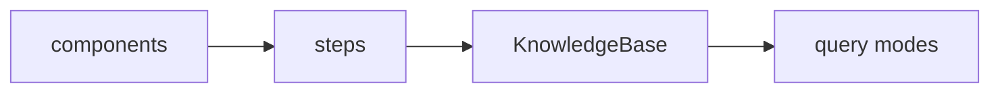
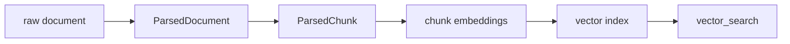
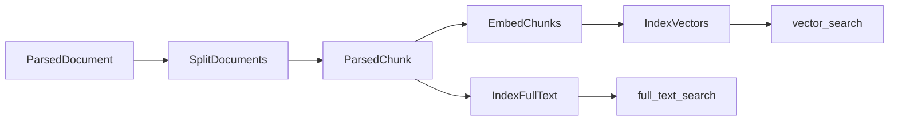
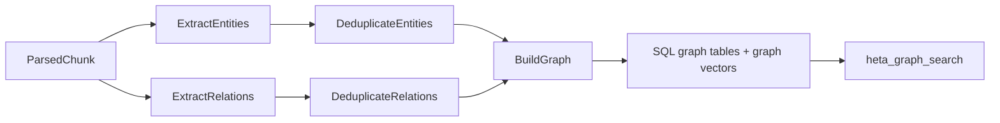
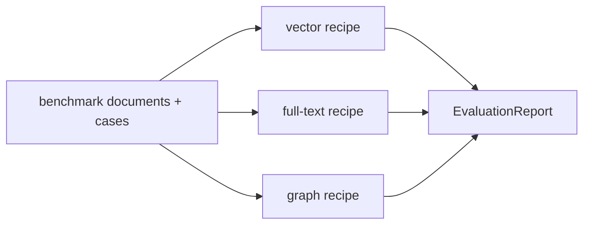
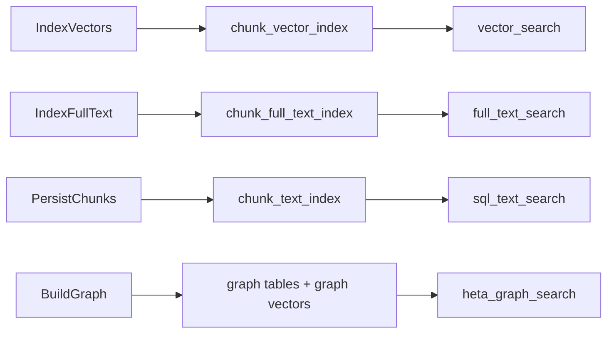

# Choose A Build Path

Heta's recommended workflow is not to start with a full GraphRAG system. Start with the smallest useful path, then add capabilities when the product question requires them.

Every path is still a recipe:



## Start With The Question

Choose the retrieval capability from the user question first.

| If the question looks like | Recommended path | Why |
| --- | --- | --- |
| "Which passages are semantically close to this?" | Vector search | Good for semantic similarity, paraphrases, and natural-language QA. |
| "Does the document contain this ID, term, clause, or abbreviation?" | Full-text search | Good for exact terms, codes, legal clauses, and product identifiers. |
| "Which entities are related, and where is the evidence?" | Heta graph search | Good for entities, relations, evidence tracing, and graph retrieval. |
| "I need both semantic chunks and entity relations." | Hybrid / Heta rerank search | Good for fusing chunk retrieval, graph retrieval, and full-text retrieval. |
| "The user question is unstable and may need rewriting." | Heta rewrite search | Good when synonyms and query phrasing vary. |
| "The answer needs multiple facts chained together." | Heta multihop search | Good for multi-round retrieval and evidence accumulation. |
| "I want to compare build strategies." | Benchmark runner | Good for comparing recipes with the same benchmark. |

## Build Paths

Common paths and the components, steps, and capabilities they require:

| Path | Components | Key steps | Opens |
| --- | --- | --- | --- |
| Vector KB | `ObjectStore`, `EmbeddingModel`, `VectorStore` | `ParseDocuments`, `SplitDocuments`, `EmbedChunks`, `IndexVectors` | `vector_search` |
| Full-text KB | `ObjectStore`, `TextIndexStore` | `ParseDocuments`, `SplitDocuments`, `IndexFullText` | `full_text_search` |
| SQL text KB | `ObjectStore`, `SQLStore` | `ParseDocuments`, `SplitDocuments`, `PersistChunks` | `sql_text_search` |
| Heta graph KB | `ObjectStore`, `LanguageModel`, `EmbeddingModel`, `SQLStore`, `VectorStore` | `HetaGraphProcedure.build().steps()` | `heta_graph_search` |
| Hybrid KB | Vector KB + Heta graph KB | Vector steps + graph steps | `hybrid_search` |
| Heta rerank KB | Hybrid KB + Full-text KB, optional `RerankModel` | Vector + graph + full-text steps | `heta_rerank_search` |
| Rewrite / multihop KB | Heta rerank KB + `LanguageModel` | Same build assets as the base modes | `heta_rewrite_search`, `heta_multihop_search` |
| Benchmark run | Benchmark adapter + recipe | No new build step | `EvaluationReport` |

## Run The Cases

The four cases in the homepage are runnable examples verified with a real OpenAI API. You can also open the interactive code window on the [homepage](../index.en.md#examples).

If you are running inside the source repository:

| Case | Install | Run |
| --- | --- | --- |
| Vector search | `python -m pip install heta-framework` | `OPENAI_API_KEY=... PYTHONPATH=src python docs/examples/home_vector_case.py` |
| Full-text search | `python -m pip install heta-framework` | `OPENAI_API_KEY=... PYTHONPATH=src python docs/examples/home_full_text_case.py` |
| Heta graph search | `python -m pip install "heta-framework[sql]"` | `OPENAI_API_KEY=... PYTHONPATH=src python docs/examples/home_graph_case.py` |
| Benchmark runner | `python -m pip install heta-framework` | `OPENAI_API_KEY=... PYTHONPATH=src python docs/examples/home_benchmark_case.py` |

If you use Heta from PyPI, copy the corresponding example into a local script and run it without `PYTHONPATH=src`:

```bash
python home_vector_case.py
```

These cases match the four homepage entries: vector KB, keyword retrieval KB, Heta graph KB, and benchmark evaluation. They use a local `ObjectStore` and in-memory stores so that you can validate the recipe shape first. In production, replace them with S3, Milvus, PostgreSQL, or Elasticsearch.

## Recommended Progression

### 1. Build a vector KB

Start with a vector KB. It validates the core path:



This path has the lowest cost and fewest dependencies. It is also the easiest way to confirm that parsing, chunking, and embedding work.

### 2. Add full-text search

If users ask questions with exact terms, add `IndexFullText`. It is a branch parallel to vector indexing and does not require SQL persistence:



This opens `full_text_search`, which is useful for identifiers, abbreviations, legal clauses, function names, and product models.

### 3. Add Heta graph search

If you need entities, relations, and evidence provenance, add the Heta graph procedure:



This writes graph facts into SQL and vector stores and opens `heta_graph_search`. If you later need `hybrid_search`, `heta_rerank_search`, `heta_rewrite_search`, or `heta_multihop_search`, this path is usually the foundation.

### 4. Evaluate the recipe

Once a recipe builds reliably, evaluate it with benchmarks. `BenchmarkRunner` builds a KB from the same recipe, runs queries, scores responses, and generates an `EvaluationReport`.

This is more reliable than judging a single query:



## How Search Is Unlocked

Heta does not make every query mode available by default. Each step declares which search assets it created, and `KnowledgeBase` only exposes modes backed by those assets.



This keeps the single `kb.query(...)` interface flexible without allowing a KB to call a mode it never built.

## Local To Production

Steps describe how to build. Components decide where the data lands. Production usually replaces components, not the recipe.

| Local development | Production |
| --- | --- |
| `LocalObjectStore` | `S3ObjectStore` |
| `InMemoryVectorStore` | `MilvusVectorStore` |
| `InMemoryTextIndexStore` | `ElasticsearchTextIndexStore` |
| SQLite `SQLStore` | PostgreSQL / MySQL `SQLStore` |

This is why Heta is a framework layer: business code can choose recipes, infrastructure can replace stores, and query code only uses available modes.

## Next

- To run a minimal KB, read [Quick Start](../quick-start.en.md).
- To understand recipes, read [What Is A Recipe](what-is-recipe.en.md).
- To query a KB, read [Query A KnowledgeBase](query-knowledge-base.en.md).
- To evaluate recipes, read [Evaluate A Recipe](evaluate-recipe.en.md).
