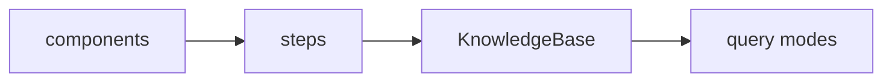
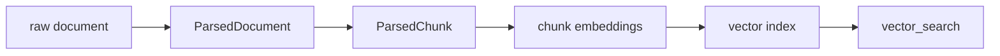
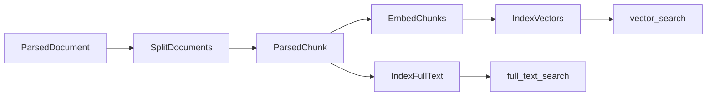
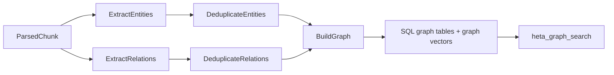
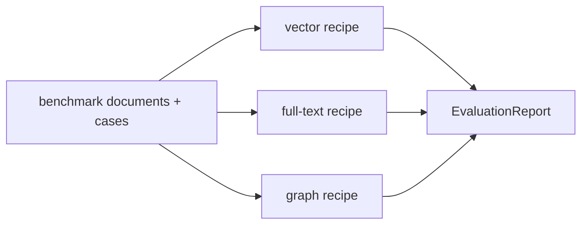
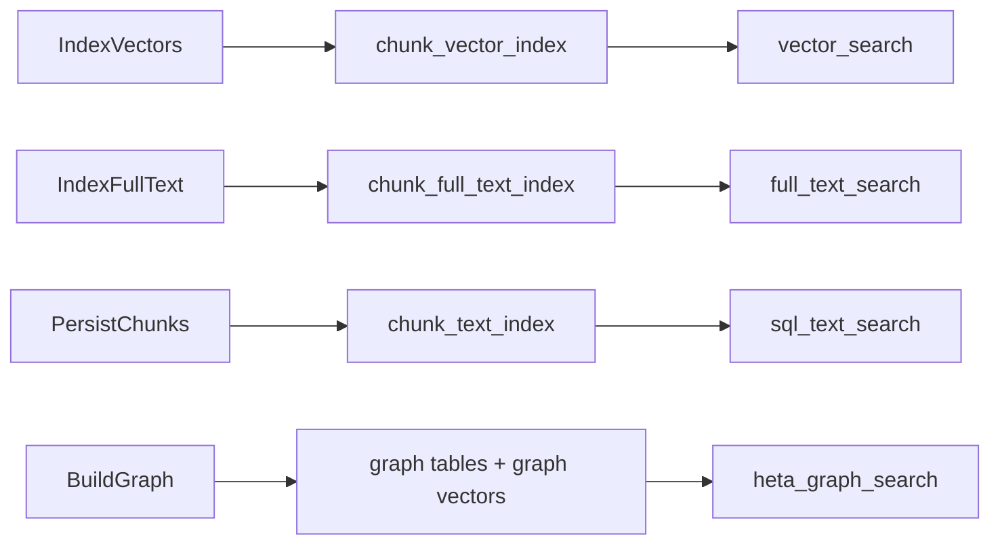

# Choose A Build Path

Heta 的推荐用法不是一开始就搭一个完整 GraphRAG，而是先选一条最小可用路径，再按业务问题增加能力。

每条路径本质上都是一个 recipe：



## Start With The Question

先从用户问题判断你需要哪种检索能力。

| 你的问题更像 | 推荐路径 | 原因 |
| --- | --- | --- |
| “这段话和哪些内容语义相近？” | Vector search | 适合语义相似、同义表达、自然语言问答。 |
| “文档里有没有这个编号、术语、条款或缩写？” | Full-text search | 适合精确词、代码、法规条款、产品型号。 |
| “这个实体和哪些实体有关？关系证据在哪里？” | Heta graph search | 适合实体、关系、证据溯源和图谱召回。 |
| “我既要语义，也要实体关系。” | Hybrid / Heta rerank search | 适合把 chunk 召回、图谱召回、全文召回融合。 |
| “问题表述模糊，可能需要改写后再搜。” | Heta rewrite search | 适合同义词多、用户问题不稳定的场景。 |
| “一个问题需要串联多个事实。” | Heta multihop search | 适合需要多轮检索和证据累积的问题。 |
| “我想比较不同构建方案哪个好。” | Benchmark runner | 适合用同一 benchmark 比较不同 recipe。 |

## Build Paths

下面是常见路径对应的 components、steps 和开放能力。

| 路径 | 需要的 components | 关键 steps | 开放能力 |
| --- | --- | --- | --- |
| Vector KB | `ObjectStore`、`EmbeddingModel`、`VectorStore` | `ParseDocuments`、`SplitDocuments`、`EmbedChunks`、`IndexVectors` | `vector_search` |
| Full-text KB | `ObjectStore`、`TextIndexStore` | `ParseDocuments`、`SplitDocuments`、`IndexFullText` | `full_text_search` |
| SQL text KB | `ObjectStore`、`SQLStore` | `ParseDocuments`、`SplitDocuments`、`PersistChunks` | `sql_text_search` |
| Heta graph KB | `ObjectStore`、`LanguageModel`、`EmbeddingModel`、`SQLStore`、`VectorStore` | `HetaGraphProcedure.build().steps()` | `heta_graph_search` |
| Hybrid KB | Vector KB + Heta graph KB | vector steps + graph steps | `hybrid_search` |
| Heta rerank KB | Hybrid KB + Full-text KB，可选 `RerankModel` | vector + graph + full-text steps | `heta_rerank_search` |
| Rewrite / multihop KB | Heta rerank KB + `LanguageModel` | 对应基础 build steps | `heta_rewrite_search`、`heta_multihop_search` |
| Benchmark run | benchmark adapter + recipe | 不需要新的 build step | `EvaluationReport` |

## Run The Cases

下面四个 case 是文档中的可运行示例，已经用真实 OpenAI API 验证过。
你也可以直接到首页的 [四个可运行 case](../index.md#examples) 查看交互式代码窗口。

如果你在源码仓库里运行，使用下面的命令：

| Case | 安装 | 运行 |
| --- | --- | --- |
| Vector search | `python -m pip install heta` | `OPENAI_API_KEY=... PYTHONPATH=src python docs/examples/home_vector_case.py` |
| Full-text search | `python -m pip install heta` | `OPENAI_API_KEY=... PYTHONPATH=src python docs/examples/home_full_text_case.py` |
| Heta graph search | `python -m pip install "heta[sql]"` | `OPENAI_API_KEY=... PYTHONPATH=src python docs/examples/home_graph_case.py` |
| Benchmark runner | `python -m pip install heta` | `OPENAI_API_KEY=... PYTHONPATH=src python docs/examples/home_benchmark_case.py` |

如果你通过 PyPI 使用 Heta，把对应 example 文件内容复制到本地脚本后运行即可，不需要设置 `PYTHONPATH=src`：

```bash
python home_vector_case.py
```

这些 case 对应首页里的四个入口：向量数据库、关键词检索数据库、Heta 式图谱型数据库和 Benchmark 评测。它们都使用本地 `ObjectStore` 和内存 store，方便先验证 recipe 结构；生产环境再替换为 S3、Milvus、PostgreSQL 或 Elasticsearch。

## Recommended Progression

### 1. Build a vector KB

先从 vector KB 开始。它验证的是最核心链路：



这条路径成本最低、依赖最少，也最容易判断 parser、chunk 和 embedding 是否正常。

### 2. Add full-text search

如果你的问题里有大量精确词，加入 `IndexFullText`。它和向量分支并列，不要求先写入 SQL：



这会开放 `full_text_search`，适合编号、缩写、法规条款、函数名、产品型号等查询。

### 3. Add Heta graph search

如果你需要实体、关系和证据溯源，加入 Heta graph procedure：



这会把 graph facts 写入 SQL 和 vector stores，并开放 `heta_graph_search`。如果你后续要做 `hybrid_search`、`heta_rerank_search`、`heta_rewrite_search` 或 `heta_multihop_search`，这条路径通常是基础。

### 4. Evaluate the recipe

当一个 recipe 能稳定构建后，再用 benchmark 评估它。BenchmarkRunner 会用同一个 recipe 建库、查询、评分，并生成 `EvaluationReport`。

这比只看单次 query 更可靠，因为它能比较：



## How Search Is Unlocked

Heta 不会让所有 query mode 默认可用。每个 step 完成后会声明自己创建了哪些 search assets，`KnowledgeBase` 只开放已经具备资产的查询方式。



这样做的好处是：同一套 `kb.query(...)` 接口可以服务不同类型的 KB，但不会误调用当前 KB 没有构建过的能力。

## Local To Production

Recipe 的 steps 表达“怎么构建”，components 决定“落在哪里”。生产化时通常替换 components，而不是重写 recipe。

| 本地开发 | 生产环境 |
| --- | --- |
| `LocalObjectStore` | `S3ObjectStore` |
| `InMemoryVectorStore` | `MilvusVectorStore` |
| `InMemoryTextIndexStore` | `ElasticsearchTextIndexStore` |
| SQLite `SQLStore` | PostgreSQL / MySQL `SQLStore` |

这也是 Heta 适合做框架层的原因：业务侧可以选 recipe，基础设施可以替换 store，query 侧只使用已经开放的 mode。

## Next

- 先跑一个最小 KB，看 [Quick Start](../quick-start.zh.md)。
- 想理解 recipe，看 [What Is A Recipe](what-is-recipe.zh.md)。
- 想查询 KB，看 [Query A KnowledgeBase](query-knowledge-base.zh.md)。
- 想评估不同 recipe，看 [Evaluate A Recipe](evaluate-recipe.zh.md)。
