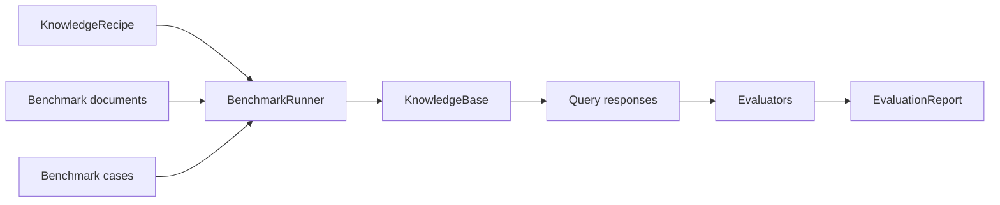

# Evaluate A Recipe

Heta evaluates a `KnowledgeRecipe`, not a temporary hand-built `KnowledgeBase`.

The reason is direct: RAG quality is not determined by one query. It depends on the full build strategy: how parsers read documents, how chunks are split, which embedding model is used, how vector indexes are built, whether full-text retrieval is included, and whether Heta-style graph knowledge is constructed.

In Heta, `KnowledgeBase` is the product of running a recipe. `EvaluationReport` is the evaluation result.



## What Gets Evaluated

One benchmark run answers one question:

> How does this recipe perform on a standard set of documents and questions?

This lets you compare build strategies fairly:

| Recipe | Typical difference |
| --- | --- |
| `vector recipe` | Builds semantic vector retrieval only. |
| `full-text recipe` | Adds BM25-style full-text retrieval. |
| `graph recipe` | Adds entities, relations, and Heta graph search. |
| `hybrid recipe` | Combines vector, full-text, graph, rewrite, rerank, or multihop modes. |

If the benchmark, query mode, and model configuration stay the same, the reports can be compared directly.

## How It Runs

`BenchmarkRunner` gives benchmark data to the recipe, then queries and scores the generated KB:

```text
prepare benchmark data
  -> write benchmark documents into ObjectStore
  -> build one or more KnowledgeBase instances from the recipe
  -> run benchmark cases with selected query modes
  -> score each response
  -> write one EvaluationReport
```

Heta supports two run shapes:

| Shape | How it runs | When to use |
| --- | --- | --- |
| Single-KB | Build one KB for the whole corpus, query all cases against it. | Standard retrieval tasks such as BEIR and SciFact. |
| Multi-KB | Build one KB per run unit, query only the cases bound to that unit. | Tasks where questions are bound to specific files or small corpora, such as UDA-fin. |

The benchmark adapter declares this. Your recipe does not need to know whether the benchmark builds one KB or many.

## Choose A Benchmark

Different benchmarks measure different capabilities. Choose the one that matches your target system.

| Benchmark | Best for | Recommended use |
| --- | --- | --- |
| [MultiHop-RAG](../core-components/evaluation/multihop-rag.en.md) | Multi-hop QA, evidence recall, complex query paths. | Evaluate `heta_graph_search`, `heta_rewrite_search`, `heta_rerank_search`, and `heta_multihop_search`. |
| [BEIR](../core-components/evaluation/beir.en.md) | Standard IR metrics such as NDCG, Recall, MAP, and MRR. | Evaluate retrieval quality, especially `vector_search` and `full_text_search`. |
| [UDA-Benchmark](../core-components/evaluation/uda-benchmark.en.md) | Real document QA across finance, tables, papers, and encyclopedia-style documents. | Evaluate the end-to-end combination of parser, retrieval, and answer generation. |

### MultiHop-RAG

MultiHop-RAG is a corpus-level benchmark. It builds one KB from all articles, then asks multi-hop questions that require evidence spread across multiple facts.

It answers:

```text
After adding graph / rewrite / rerank / multihop, does evidence recall improve for complex questions?
```

It is not just testing whether the nearest chunk is correct; it focuses on whether multiple pieces of evidence can be found together.

### BEIR

BEIR is a standard retrieval benchmark. It focuses on document-level ranking and does not require answer generation.

It answers:

```text
Is the base retrieval capability stable?
Do recall and NDCG improve after changing embedding model, chunk size, vector store, or full-text index?
```

Heta recommends starting with `scifact` because it is small, stable, and suitable for smoke tests. Then expand to `nfcorpus`, `fiqa`, or `hotpotqa`.

### UDA-Benchmark

UDA-Benchmark is closer to business documents. Many questions are bound to a specific PDF, table, or web document. Heta groups them into run units, builds one KB per unit, and evaluates the bound questions.

It answers:

```text
Can this recipe parse, retrieve, and answer reliably on real PDFs, tables, papers, or encyclopedia documents?
```

If you care about parser, chunking, retrieval, and answer generation together, UDA is closer to real use than a pure retrieval benchmark.

## Read The Report

`EvaluationReport` records:

| Field | Use |
| --- | --- |
| `benchmark` | Dataset, version, and split. |
| `query_modes` | Query modes used in this run. |
| `case_results` | Query response, citations, metrics, and error for each case. |
| `score_summary` | Aggregated metrics for comparing recipes. |
| `report_key` | Where the report is saved in ObjectStore. |

If the recipe has an `ObjectStore`, the report is written by default to:

```text
_heta/knowledge_bases/{knowledge_base_name}/evaluations/{report_id}/report.json
```

Start by reading three kinds of results:

| Result | Meaning |
| --- | --- |
| retrieval metrics | Whether the correct evidence was retrieved, such as recall@k or ndcg@k. |
| answer metrics | Whether the generated answer contains the expected answer or target value. |
| case errors | Which cases failed; these often expose parser, store, provider, or query mode issues. |

## Good Defaults

A good first evaluation sequence:

1. Run BEIR SciFact with `vector_search` to validate base retrieval.
2. Add `IndexFullText` and run `full_text_search` to check exact-term retrieval.
3. Add Heta graph procedure and run MultiHop-RAG to check evidence recall for complex questions.
4. Run UDA-Benchmark on real documents to check parsing, retrieval, and answer generation together.

This sequence moves from light to heavy and helps locate problems quickly.

## Next

- To configure the runner, read [BenchmarkRunner](../core-components/evaluation/benchmark-runner.en.md).
- To add your own benchmark, read [Benchmark Protocols](../core-components/evaluation/benchmark-protocols.en.md).
- To understand report structure, read [Evaluation Reports](../core-components/evaluation/evaluation-reports.en.md).
