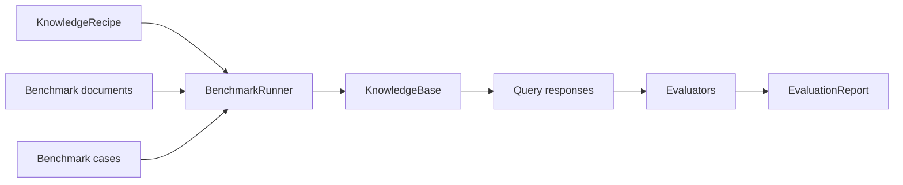

# Evaluate A Recipe

Heta 评估的是一套 `KnowledgeRecipe`，而不是一个临时手工搭好的 `KnowledgeBase`。

原因很直接：RAG 系统的效果不是由某一次 query 单独决定的，而是由完整构建方案共同决定的。Parser 怎么解析，chunk 怎么切，embedding 用哪个模型，向量库怎么建，是否加入全文检索，是否构建 Heta-style graph knowledge，这些选择都会改变最终检索和回答效果。

在 Heta 里，`KnowledgeBase` 是 recipe 运行后的产物；`EvaluationReport` 才是评估结果。



## What Gets Evaluated

一次 benchmark run 会回答一个问题：

> 这套 recipe 在一组标准文档和问题上表现如何？

这让你可以公平比较不同构建方案：

| Recipe | 典型差异 |
| --- | --- |
| `vector recipe` | 只构建 semantic vector retrieval。 |
| `full-text recipe` | 在 vector 之外加入 BM25-style full-text retrieval。 |
| `graph recipe` | 加入 entity、relation 和 Heta graph search。 |
| `hybrid recipe` | 组合 vector、full-text、graph、rewrite、rerank 或 multihop query modes。 |

只要 benchmark、query mode 和模型配置保持一致，报告之间就可以直接对比。

## How It Runs

`BenchmarkRunner` 负责把 benchmark 数据交给 recipe，然后用生成的 KB 执行查询和评分：

```text
prepare benchmark data
  -> write benchmark documents into ObjectStore
  -> build one or more KnowledgeBase instances from the recipe
  -> run benchmark cases with selected query modes
  -> score each response
  -> write one EvaluationReport
```

Heta 支持两种运行形态。

| 形态 | 怎么运行 | 什么时候用 |
| --- | --- | --- |
| Single-KB | 整个 corpus 建成一个 KB，所有 cases 都查这个 KB。 | 标准检索任务，例如 BEIR、SciFact。 |
| Multi-KB | 每个 run unit 建一个 KB，只回答绑定到这个 unit 的 cases。 | 问题绑定到具体文件或小语料的任务，例如 UDA-fin。 |

这个差异由 benchmark adapter 声明。你写 recipe 时不需要关心它最终会建一个 KB 还是多个 KB。

## Choose A Benchmark

不同 benchmark 评估的能力不同。不要只看“能不能跑”，更重要的是选择和目标系统匹配的数据。

| Benchmark | 最适合评估什么 | 推荐场景 |
| --- | --- | --- |
| [MultiHop-RAG](../core-components/evaluation/multihop-rag.zh.md) | 多跳问答、证据召回、复杂查询路径。 | 评估 `heta_graph_search`、`heta_rewrite_search`、`heta_rerank_search`、`heta_multihop_search`。 |
| [BEIR](../core-components/evaluation/beir.zh.md) | 标准 information retrieval 指标，例如 NDCG、Recall、MAP、MRR。 | 评估纯检索质量，尤其是 `vector_search` 和 `full_text_search`。 |
| [UDA-Benchmark](../core-components/evaluation/uda-benchmark.zh.md) | 真实文档问答，包含金融、表格、论文、百科等文档类型。 | 评估 parser、retrieval、answer generation 组合后的端到端表现。 |

### MultiHop-RAG

MultiHop-RAG 是 corpus-level benchmark。它会把全量文章构建成一个 KB，然后用多跳问题检查系统能否找到分散在多个证据里的信息。

适合用来回答：

```text
加入 graph / rewrite / rerank / multihop 后，复杂问题的证据召回是否更好？
```

它不只是测“最相似 chunk 是否命中”，而是更关注多条 evidence 是否能被共同找回。

### BEIR

BEIR 是标准检索 benchmark。它的重点是文档级检索排序，不要求生成答案。

适合用来回答：

```text
这套 recipe 的基础检索能力是否稳定？
换 embedding、chunk size、vector store 或 full-text index 后，Recall/NDCG 是否提升？
```

Heta 第一版推荐从 `scifact` 开始，因为它小、稳定、适合 smoke test；之后再扩展到 `nfcorpus`、`fiqa` 或 `hotpotqa`。

### UDA-Benchmark

UDA-Benchmark 更接近真实业务文档。很多问题绑定到具体 PDF、表格或网页文档，所以 Heta 会按文档生成多个 run units，每个 unit 单独建 KB 并回答自己的问题。

适合用来回答：

```text
这套 recipe 面对真实 PDF、表格、论文或百科文档时，能不能稳定解析、检索并回答？
```

如果你关心 parser、chunk、retrieval 和 answer generation 的整体效果，UDA 比纯检索 benchmark 更贴近业务。

## Read The Report

`EvaluationReport` 会记录：

| 内容 | 用途 |
| --- | --- |
| `benchmark` | 本次评估使用的数据集、版本和 split。 |
| `query_modes` | 本次调用了哪些 query modes。 |
| `case_results` | 每个 case 的 query response、citations、metrics 和 error。 |
| `score_summary` | 聚合后的指标，适合做 recipe 间对比。 |
| `report_key` | report 在 ObjectStore 中的保存位置。 |

如果 recipe 配置了 `ObjectStore`，报告默认写入：

```text
_heta/knowledge_bases/{knowledge_base_name}/evaluations/{report_id}/report.json
```

评估时建议先看三类结果：

| 结果 | 说明 |
| --- | --- |
| retrieval metrics | 检索是否找到了正确证据，例如 recall@k、ndcg@k。 |
| answer metrics | 生成答案是否包含标准答案或目标值。 |
| case errors | 哪些 case 没跑完，通常能暴露 parser、store、provider 或 query mode 的问题。 |

## Good Defaults

第一轮 recipe 评估可以按这个顺序做：

1. 用 BEIR SciFact 跑 `vector_search`，确认基础检索能稳定工作。
2. 加入 `IndexFullText` 后跑 `full_text_search`，观察关键词检索是否补足精确术语。
3. 加入 Heta graph procedure 后跑 MultiHop-RAG，观察复杂问题的证据召回。
4. 用 UDA-Benchmark 跑真实文档任务，检查解析、检索和回答链路是否适合业务文档。

这个顺序从轻到重，能更快定位问题：先验证检索，再验证图谱，再验证真实文档端到端效果。

## Next

- 想看 runner 的配置方式，读 [BenchmarkRunner](../core-components/evaluation/benchmark-runner.zh.md)。
- 想扩展自己的 benchmark，读 [Benchmark Protocols](../core-components/evaluation/benchmark-protocols.zh.md)。
- 想了解报告结构，读 [Evaluation Reports](../core-components/evaluation/evaluation-reports.zh.md)。
