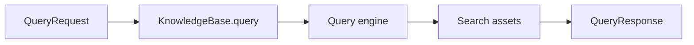
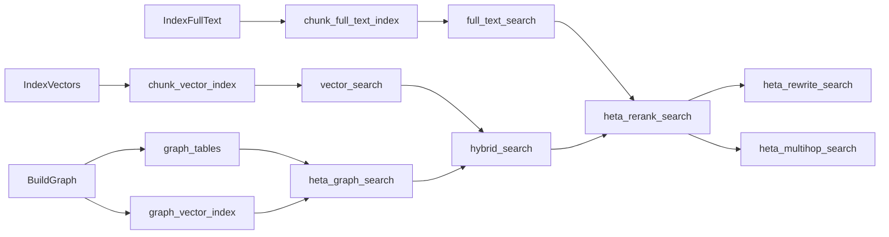

# Query A KnowledgeBase

`KnowledgeBase` is Heta's single query entry point. You do not need to remember every low-level store API; choose a query mode that the current KB already supports.



## Check What The KB Can Query

Every query mode comes from build steps. After the build, inspect what the KB supports:

```python
print(sorted(kb.available_queries))
```

Common results:

```text
['vector_search']
['full_text_search', 'vector_search']
['heta_graph_search', 'hybrid_search', 'heta_rerank_search', 'vector_search']
```

If you call a mode the KB did not build, Heta raises a clear error instead of returning a result that looks valid but is not reliable.

## Query Input

All built-in query modes use the same entry point:

```python
response = await kb.query(
    "How does Heta build a knowledge base?",
    mode="vector_search",
    top_k=5,
    filters={},
    options={"generate_answer": True},
    trace=False,
)
```

| Parameter | Meaning |
| --- | --- |
| `text` | User question or retrieval text. |
| `mode` | Query mode, such as `vector_search`, `full_text_search`, or `heta_graph_search`. |
| `top_k` | Number of results to return. |
| `filters` | Filters passed to the underlying store. Supported fields depend on the store. |
| `options` | Optional query engine behavior, such as answer generation, fusion weights, or max multihop rounds. |
| `trace` | Whether to return structured trace events for debugging. |

## Query Output

`kb.query(...)` returns `QueryResponse`:

| Field | Meaning |
| --- | --- |
| `mode` | Query mode actually used. |
| `answer` | Optional answer. Returned only when answer generation is enabled and a `LanguageModel` is available. |
| `results` | Retrieved results. Each result includes `id`, `text`, `score`, `kind`, `source`, and `metadata`. |
| `citations` | Citations and source information derived from results. |
| `trace` | Optional debug events. Returned only when `trace=True`. |
| `metadata` | Engine metadata such as collection name, index name, fusion settings, or issues. |

Most code reads:

```python
print(response.answer)
for result in response.results:
    print(result.score, result.text, result.source)
```

## Choose A Query Mode

Choose by question type. Do not default to the most complex mode because it feels stronger; complex modes require more assets and models, and increase latency and cost.

| Mode | Use when | Avoid when |
| --- | --- | --- |
| `vector_search` | The question is natural language and you want semantically close chunks. | The query is mostly exact IDs, short code, or fixed terms. |
| `full_text_search` | The query contains explicit keywords, IDs, terms, clauses, or function names. | The query has many synonyms or unstable keywords. |
| `sql_text_search` | Chunks were persisted with `PersistChunks` and SQL text matching or evidence lookup is needed. | You need BM25-style full-text ranking. |
| `heta_graph_search` | You need entities, relations, and evidence provenance. | You only need simple semantic chunks. |
| `hybrid_search` | You need both vector and graph recall with RRF fusion. | The KB has no graph assets. |
| `heta_rerank_search` | You want to fuse vector, graph, and full-text results, optionally with a reranker. | You want low latency and no extra model cost. |
| `heta_rewrite_search` | The user question is vague and should be expanded into query variants. | Exact keyword retrieval is enough. |
| `heta_multihop_search` | The question needs multiple retrieval rounds and evidence accumulation. | Single-hop fact lookup or low-latency search. |

## Required Assets

Each mode depends on search assets produced by build steps.

| Mode | Main assets | Usually produced by |
| --- | --- | --- |
| `vector_search` | `chunk_vector_index` | `IndexVectors` |
| `full_text_search` | `chunk_full_text_index` | `IndexFullText` |
| `sql_text_search` | `chunk_text_index` | `PersistChunks` |
| `heta_graph_search` | `graph_tables`, `graph_vector_index` | `BuildGraph` or `MergeGraphIntoStore` |
| `hybrid_search` | `chunk_vector_index`, `graph_tables`, `graph_vector_index` | `IndexVectors` + graph steps |
| `heta_rerank_search` | vector + graph + full-text assets | vector + graph + `IndexFullText` |
| `heta_rewrite_search` | `models.language` + base search assets | Usually reuses `heta_rerank_search` assets |
| `heta_multihop_search` | `models.language` + base search assets | Usually reuses `heta_rerank_search` assets |



## Answer Generation

Retrieval and answer generation are separate. Query can return evidence only; enable answer generation when you need it:

```python
response = await kb.query(
    "What does this document say about Heta recipes?",
    mode="vector_search",
    top_k=3,
    options={"generate_answer": True},
)
```

Each query engine owns its own answer-generation behavior. Graph search uses graph evidence; full-text search uses keyword-matched chunks.

If `KnowledgeModels.language` is not configured, retrieval still returns `results`, but no `answer` is generated.

## Trace And Issues

Enable trace when debugging retrieval:

```python
response = await kb.query(
    "How does the graph search work?",
    mode="heta_graph_search",
    top_k=5,
    trace=True,
)

for event in response.trace:
    print(event.stage, event.message, event.metadata)
```

Recoverable issues can appear in `response.metadata["issues"]`, such as query rewrite falling back to base retrieval or multihop search reaching the maximum number of rounds.

## Good Defaults

In practice:

1. Start with `vector_search` to validate the minimal KB.
2. Add `full_text_search` for keyword-heavy workloads.
3. Add `heta_graph_search` when entities, relations, and provenance matter.
4. Use `hybrid_search` or `heta_rerank_search` for combined recall.
5. Use `heta_rewrite_search` when query phrasing is unstable.
6. Use `heta_multihop_search` for multi-hop questions.

## Next

- To add the required build assets, read [Choose A Build Path](choose-build-path.en.md).
- To understand each Heta mode, read [Heta Query Modes](../core-components/search/heta-query-modes.en.md).
- To see the low-level protocol, read [Query Protocols](../core-components/search/query-protocols.en.md).
