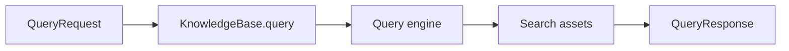
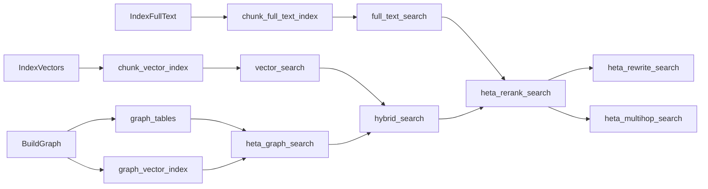

# Query A KnowledgeBase

`KnowledgeBase` 是 Heta 的统一查询入口。你不需要记住每个底层 store 的查询 API，只需要选择一个当前 KB 已经支持的 query mode。



## Check What The KB Can Query

每个 query mode 都来自 build steps。构建完成后，先看当前 KB 支持什么：

```python
print(sorted(kb.available_queries))
```

常见结果：

```text
['vector_search']
['full_text_search', 'vector_search']
['heta_graph_search', 'hybrid_search', 'heta_rerank_search', 'vector_search']
```

如果调用了当前 KB 没有构建过的 mode，Heta 会明确报错，而不是返回一个看似正常但实际不可靠的结果。

## Query Input

所有内置 query mode 都走同一个入口：

```python
response = await kb.query(
    "How does Heta build a knowledge base?",
    mode="vector_search",
    top_k=5,
    filters={},
    options={"generate_answer": True},
    trace=False,
)
```

| 参数 | 说明 |
| --- | --- |
| `text` | 用户问题或检索文本。 |
| `mode` | 查询方式，例如 `vector_search`、`full_text_search`、`heta_graph_search`。 |
| `top_k` | 返回多少条结果。 |
| `filters` | 传给底层 store 的过滤条件。不同 store 支持的字段可能不同。 |
| `options` | query engine 的可选行为，例如是否生成 answer、融合权重、最大多跳轮数。 |
| `trace` | 是否返回结构化 trace，方便调试。 |

## Query Output

`kb.query(...)` 返回 `QueryResponse`：

| 字段 | 说明 |
| --- | --- |
| `mode` | 实际使用的 query mode。 |
| `answer` | 可选答案。只有开启答案生成并且有可用 `LanguageModel` 时才会返回。 |
| `results` | 检索结果列表。每条结果包含 `id`、`text`、`score`、`kind`、`source` 和 `metadata`。 |
| `citations` | 从结果中整理出的引用和来源信息。 |
| `trace` | 可选调试事件。只有 `trace=True` 时返回。 |
| `metadata` | query engine 的补充信息，例如使用的 collection、index、融合参数或 issues。 |

最常用的是：

```python
print(response.answer)
for result in response.results:
    print(result.score, result.text, result.source)
```

## Choose A Query Mode

先按问题类型选择 mode。不要为了“更强”默认使用最复杂模式；复杂模式依赖更多资产和模型，也会增加延迟和成本。

| Mode | 什么时候用 | 不适合 |
| --- | --- | --- |
| `vector_search` | 用户问题是自然语言，想找语义相近 chunk。 | 精确编号、短代码、固定术语为主的查询。 |
| `full_text_search` | 查询包含明确关键词、编号、术语、条款、函数名。 | 同义表达很多、关键词不稳定的查询。 |
| `sql_text_search` | 已经用 `PersistChunks` 把 chunk 写入 SQL，并希望用 SQL 做文本匹配或证据查询。 | 需要 BM25-style 排序的全文检索。 |
| `heta_graph_search` | 需要实体、关系、证据溯源。 | 只需要简单语义 chunk 的问题。 |
| `hybrid_search` | 同时需要向量召回和图谱召回，用 RRF 融合结果。 | 没有构建 graph assets 的 KB。 |
| `heta_rerank_search` | 想把向量、图谱、全文结果融合，并可选使用 reranker 提升排序。 | 不想引入额外模型成本或延迟的简单查询。 |
| `heta_rewrite_search` | 用户问题表述模糊，可能需要生成多个查询变体。 | 关键词非常明确、一次检索就足够的问题。 |
| `heta_multihop_search` | 一个问题需要多轮检索、信息累积和保守作答。 | 单跳 fact lookup 或低延迟查询。 |

## Required Assets

每个 mode 都依赖 build steps 产生的 search assets。

| Mode | 主要资产 | 通常由哪个 step 产生 |
| --- | --- | --- |
| `vector_search` | `chunk_vector_index` | `IndexVectors` |
| `full_text_search` | `chunk_full_text_index` | `IndexFullText` |
| `sql_text_search` | `chunk_text_index` | `PersistChunks` |
| `heta_graph_search` | `graph_tables`、`graph_vector_index` | `BuildGraph` 或 `MergeGraphIntoStore` |
| `hybrid_search` | `chunk_vector_index`、`graph_tables`、`graph_vector_index` | `IndexVectors` + graph steps |
| `heta_rerank_search` | vector + graph + full-text assets | vector + graph + `IndexFullText` |
| `heta_rewrite_search` | `models.language` + base search assets | 通常复用 `heta_rerank_search` 的资产 |
| `heta_multihop_search` | `models.language` + base search assets | 通常复用 `heta_rerank_search` 的资产 |



## Answer Generation

检索和答案生成是分开的。默认 query 可以只返回 evidence；需要答案时，在 `options` 中开启：

```python
response = await kb.query(
    "What does this document say about Heta recipes?",
    mode="vector_search",
    top_k=3,
    options={"generate_answer": True},
)
```

答案生成由对应 query engine 自己处理。比如 graph search 会用 graph evidence 组织 prompt，full-text search 会用关键词命中的 chunk 组织 prompt。

如果没有配置 `KnowledgeModels.language`，检索仍然可以返回 `results`，但不会生成 `answer`。

## Trace And Issues

调试检索时可以打开 trace：

```python
response = await kb.query(
    "How does the graph search work?",
    mode="heta_graph_search",
    top_k=5,
    trace=True,
)

for event in response.trace:
    print(event.stage, event.message, event.metadata)
```

一些可恢复问题会进入 `response.metadata["issues"]`，例如 query rewrite 失败后退回基础检索，或 multihop 达到最大轮数后生成保守答案。

## Good Defaults

实际使用时可以按这个顺序选：

1. 先用 `vector_search` 验证最小 KB。
2. 关键词强的业务，加入 `full_text_search`。
3. 需要实体关系和证据溯源，加入 `heta_graph_search`。
4. 需要综合召回，使用 `hybrid_search` 或 `heta_rerank_search`。
5. 问题表述不稳定，用 `heta_rewrite_search`。
6. 多跳问题，用 `heta_multihop_search`。

## Next

- 想给 KB 添加对应能力，看 [Choose A Build Path](choose-build-path.zh.md)。
- 想看每个 Heta mode 的细节，看 [Heta Query Modes](../core-components/search/heta-query-modes.zh.md)。
- 想看底层协议，看 [Query Protocols](../core-components/search/query-protocols.zh.md)。
