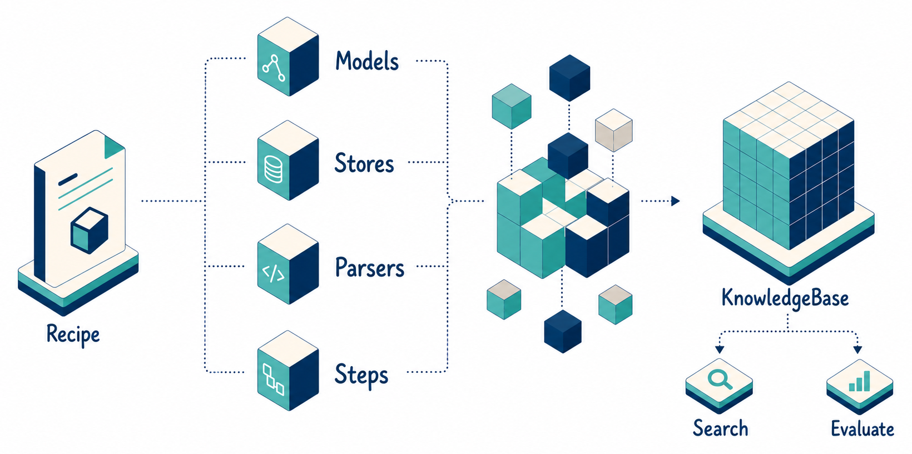

---
hide:
  - navigation
  - toc
---

<section class="heta-home" data-heta-home>
  <nav class="heta-home__nav" aria-label="Heta Framework 首页导航">
    <a class="heta-home__brand" href="./">
      
      <span>Heta Framework</span>
    </a>
    <div class="heta-home__links">
      <a href="https://github.com/KnowledgeXLab/Heta_Framework">GitHub</a>
      <a href="https://knowledgexlab.github.io/">KnowledgeX Lab</a>
      <div class="heta-home__language-switch" aria-label="语言切换">
        <span aria-current="true">中文</span>
        <a href="en/" hreflang="en">English</a>
      </div>
      <a class="heta-home__nav-cta" href="quick-start/">快速开始</a>
    </div>
  </nav>

  <section class="heta-home__hero" aria-labelledby="heta-home-title">
    <div class="heta-home__hero-copy">
      <h1 id="heta-home-title">
        <span>通过 Heta</span>
        <span>构建你想要的</span>
        <span>知识库。</span>
      </h1>
      <p class="heta-home__lead">
        Heta 将知识库构建拆成清晰的组件：models、stores、parsers、
        steps、search modes 和 benchmarks。你可以先搭建一个简单的向量知识库，
        再按需要加入关键词检索、Heta 式图谱知识和评测能力。
      </p>
      <div class="heta-home__actions">
        <a class="heta-home__button heta-home__button--primary" href="quick-start/">
          快速开始
        </a>
        <a class="heta-home__button" href="guides/what-is-recipe/">
          什么是 Recipe？
        </a>
      </div>
    </div>

    <div class="heta-home__visual" aria-label="Recipe 方块组装成 KnowledgeBase">
      
      <svg class="heta-home__workflow-overlay" viewBox="0 0 1640 817" aria-hidden="true">
        <defs>
          <linearGradient id="heta-flow-gradient" x1="0" y1="0" x2="1" y2="0">
            <stop offset="0%" stop-color="#7fc5c9" stop-opacity="0" />
            <stop offset="45%" stop-color="#2f9bac" stop-opacity="0.9" />
            <stop offset="100%" stop-color="#0b3e75" stop-opacity="0" />
          </linearGradient>
          <radialGradient id="heta-soft-aura" cx="50%" cy="50%" r="50%">
            <stop offset="0%" stop-color="#7fc5c9" stop-opacity="0.26" />
            <stop offset="58%" stop-color="#2f9bac" stop-opacity="0.08" />
            <stop offset="100%" stop-color="#2f9bac" stop-opacity="0" />
          </radialGradient>
        </defs>
        <ellipse class="heta-home__workflow-aura heta-home__workflow-aura--cluster" cx="1010" cy="390" rx="170" ry="125" />
        <ellipse class="heta-home__workflow-aura heta-home__workflow-aura--kb" cx="1388" cy="360" rx="190" ry="130" />
        <g class="heta-home__workflow-traces">
          <path d="M250 362 H372 V126 H790 C845 126 820 360 900 360" />
          <path d="M250 362 H372 V318 H790 C845 318 820 360 900 360" />
          <path d="M250 362 H372 V500 H790 C845 500 820 360 900 360" />
          <path d="M250 362 H372 V684 H790 C845 684 820 360 900 360" />
          <path d="M1128 362 H1235" />
        </g>
        <g class="heta-home__workflow-energy">
          <path style="--delay: 0s" d="M250 362 H372 V126 H790 C845 126 820 360 900 360" />
          <path style="--delay: 0.55s" d="M250 362 H372 V318 H790 C845 318 820 360 900 360" />
          <path style="--delay: 1.1s" d="M250 362 H372 V500 H790 C845 500 820 360 900 360" />
          <path style="--delay: 1.65s" d="M250 362 H372 V684 H790 C845 684 820 360 900 360" />
          <path style="--delay: 2.1s" d="M1128 362 H1235" />
        </g>
      </svg>
    </div>
  </section>

  <section class="heta-home__strip" aria-label="Heta 核心 components">
    <span>Models</span>
    <span>Stores</span>
    <span>Parsers</span>
    <span>Steps</span>
    <span>Search</span>
    <span>Benchmarks</span>
  </section>

  <section class="heta-home__how" aria-labelledby="heta-how-title">
    <div class="heta-home__section-head heta-home__section-head--stacked">
      <p class="heta-home__eyebrow">工作方式</p>
      <p id="heta-how-title" class="heta-home__section-intro">
        Heta 不要求你一次写完一整套复杂 RAG 流程。你先用 Recipe 选好
        models、stores、parsers 和 steps，Heta 再按这个 Recipe 构建 KnowledgeBase。
        建好以后，系统会知道它支持哪些 Search 方式，也可以直接跑 Benchmark。
      </p>
    </div>

    <div class="heta-home__process" data-heta-process>
      <article class="heta-home__process-item">
        <figure class="heta-home__process-image">
          
        </figure>
        <div class="heta-home__process-copy">
          <span>01</span>
          <h3>Recipe</h3>
          <p>
            Recipe 就是知识库的配置清单。你在这里写清楚要用哪个 model、把文件存到哪里、
            用哪些 parser、按什么 steps 构建。以后要复用或调整知识库，只需要改这份 Recipe。
          </p>
        </div>
      </article>
      <article class="heta-home__process-item">
        <figure class="heta-home__process-image">
          
        </figure>
        <div class="heta-home__process-copy">
          <span>02</span>
          <h3>Steps</h3>
          <p>
            Steps 是真正执行构建的步骤，比如 parse、split、embed、index 或 build graph。
            你可以只用向量检索需要的 steps，也可以继续加入 Heta graph 相关 steps。
          </p>
        </div>
      </article>
      <article class="heta-home__process-item">
        <figure class="heta-home__process-image">
          
        </figure>
        <div class="heta-home__process-copy">
          <span>03</span>
          <h3>Search</h3>
          <p>
            Search 会根据 KnowledgeBase 已经建好的内容工作。建了 vector index 就能用
            vector search，建了 text index 就能用 full-text search，建了 graph 就能用
            Heta graph search。
          </p>
        </div>
      </article>
      <article class="heta-home__process-item">
        <figure class="heta-home__process-image">
          
        </figure>
        <div class="heta-home__process-copy">
          <span>04</span>
          <h3>Benchmark</h3>
          <p>
            Benchmark 用同一个 Recipe 自动建库、发起 query，并生成 evaluation report。
            这样你可以比较不同 Recipe 的效果，而不是只凭感觉判断哪套方案更好。
          </p>
        </div>
      </article>
    </div>
  </section>

  <section id="examples" class="heta-home__paths" aria-labelledby="heta-paths-title">
    <div class="heta-home__section-head heta-home__section-head--stacked">
      <p class="heta-home__eyebrow">四个 case</p>
      <p id="heta-paths-title" class="heta-home__section-intro">
        下面四个 case 使用本地 ObjectStore 和内存 store，模型默认走常见的
        OpenAI LLM 与 embedding API。换成 Qwen、Milvus、
        PostgreSQL 或 Elasticsearch 时，只需要替换对应 component。
      </p>
    </div>

    <div class="heta-home__playground" data-heta-code-tabs>
      <aside class="heta-home__playground-nav" aria-label="选择一个 case">
        <button class="heta-home__case-tab is-active" type="button" role="tab" aria-selected="true"
          data-heta-code-tab="vector" data-title="examples/home_vector_case.py">
          <span>01</span>
          <strong>向量数据库</strong>
        </button>
        <button class="heta-home__case-tab" type="button" role="tab" aria-selected="false"
          data-heta-code-tab="full-text" data-title="examples/home_full_text_case.py">
          <span>02</span>
          <strong>关键词检索数据库</strong>
        </button>
        <button class="heta-home__case-tab" type="button" role="tab" aria-selected="false"
          data-heta-code-tab="graph" data-title="examples/home_graph_case.py">
          <span>03</span>
          <strong>Heta 式图谱型数据库</strong>
        </button>
        <button class="heta-home__case-tab" type="button" role="tab" aria-selected="false"
          data-heta-code-tab="benchmark" data-title="examples/home_benchmark_case.py">
          <span>04</span>
          <strong>Benchmark 评测</strong>
        </button>
      </aside>

      <div class="heta-home__terminal">
        <div class="heta-home__terminal-bar">
          <div class="heta-home__terminal-dots" aria-hidden="true">
            <span></span>
            <span></span>
            <span></span>
          </div>
          <div class="heta-home__terminal-title" data-heta-terminal-title>
            examples/home_vector_case.py
          </div>
        </div>

        <div class="heta-home__terminal-body">
          <article class="heta-home__terminal-panel is-active" data-heta-code-panel="vector" markdown="1">
          <div class="heta-home__run-command">
            <span>$</span>
            <code>OPENAI_API_KEY=... PYTHONPATH=src python docs/examples/home_vector_case.py</code>
          </div>

```python
--8<-- "docs/examples/home_vector_case.py"
```
          <div class="heta-home__terminal-output">
            <span>Example output</span>
            <pre><code>Heta builds a knowledge base by creating KnowledgeBase objects from Recipe definitions [1].
Heta builds KnowledgeBase objects from Recipe definitions. Vector search retrieves chunks by semantic similarity.</code></pre>
          </div>
        </article>

        <article class="heta-home__terminal-panel" data-heta-code-panel="full-text" markdown="1">
          <div class="heta-home__run-command">
            <span>$</span>
            <code>OPENAI_API_KEY=... PYTHONPATH=src python docs/examples/home_full_text_case.py</code>
          </div>

```python
--8<-- "docs/examples/home_full_text_case.py"
```
          <div class="heta-home__terminal-output">
            <span>Example output</span>
            <pre><code>BM25-style retrieval is useful for exact terms and identifiers [1].
Heta can add full-text search with IndexFullText. BM25-style retrieval is useful for exact terms and identifiers.</code></pre>
          </div>
        </article>

        <article class="heta-home__terminal-panel" data-heta-code-panel="graph" markdown="1">
          <div class="heta-home__run-command">
            <span>$</span>
            <code>OPENAI_API_KEY=... PYTHONPATH=src python docs/examples/home_graph_case.py</code>
          </div>

```python
--8<-- "docs/examples/home_graph_case.py"
```
          <div class="heta-home__terminal-output">
            <span>Example output</span>
            <pre><code>Heta creates a KnowledgeBase by building it from recipes [1][2][3].
relation Relation: Heta -> KnowledgeBase
Name: builds
Type: creates
Description: Heta builds knowledge bases from recipes.</code></pre>
          </div>
        </article>

        <article class="heta-home__terminal-panel" data-heta-code-panel="benchmark" markdown="1">
          <div class="heta-home__run-command">
            <span>$</span>
            <code>OPENAI_API_KEY=... PYTHONPATH=src python docs/examples/home_benchmark_case.py</code>
          </div>

```python
--8<-- "docs/examples/home_benchmark_case.py"
```
          <div class="heta-home__terminal-output">
            <span>Example output</span>
            <pre><code>{'vector_search.evidence_recall@1': 1.0}
_heta/knowledge_bases/home-benchmark/evaluations/home_demo/report.json</code></pre>
          </div>
        </article>
        </div>
      </div>
    </div>
  </section>

  <section class="heta-home__case" aria-labelledby="heta-case-title">
    <div>
      <p class="heta-home__eyebrow">Benchmark 支持</p>
      <p id="heta-case-title" class="heta-home__section-intro heta-home__section-intro--narrow">
        Benchmark adapter 负责准备数据、构建 KnowledgeBase、运行 query modes，
        并生成 evaluation report。你可以使用内置 benchmark，也可以按协议接入自己的业务评测集。
      </p>
    </div>
    <div class="heta-home__case-grid">
      <div>
        <strong>
          <a href="https://github.com/yixuantt/MultiHop-RAG" target="_blank" rel="noopener">
            MultiHop-RAG
          </a>
        </strong>
        <span>
          多跳问答 benchmark，适合验证复杂 query、证据召回和 multi-hop search。
          <a href="https://huggingface.co/datasets/yixuantt/MultiHopRAG" target="_blank" rel="noopener">Dataset</a>
        </span>
      </div>
      <div>
        <strong>
          <a href="https://github.com/beir-cellar/beir" target="_blank" rel="noopener">
            BEIR
          </a>
        </strong>
        <span>
          标准信息检索 benchmark，已支持 SciFact、NFCorpus、FiQA 和 HotpotQA 子集。
          <a href="https://public.ukp.informatik.tu-darmstadt.de/thakur/BEIR/datasets/" target="_blank" rel="noopener">Datasets</a>
        </span>
      </div>
      <div>
        <strong>
          <a href="https://github.com/qinchuanhui/UDA-Benchmark" target="_blank" rel="noopener">
            UDA-Benchmark
          </a>
        </strong>
        <span>
          真实文档分析 benchmark，支持按 case 构建多个 KB 来评测不同 Recipe。
          <a href="https://huggingface.co/datasets/qinchuanhui/UDA-QA" target="_blank" rel="noopener">Source documents</a>
        </span>
      </div>
    </div>
  </section>
</section>
